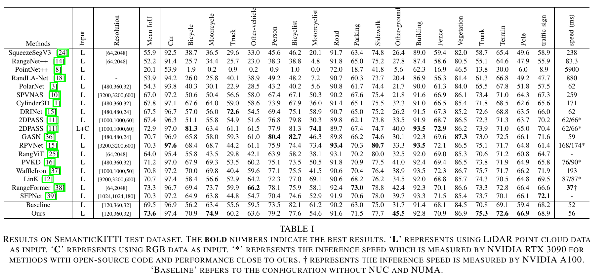

# NUC-Net: Non-uniform Cylindrical Partition Network for Efficient LiDAR Semantic Segmentation

## News
- NUC-Net was accepted to IEEE Transactions on Circuits and Systems for Video Technology (TCSVT) in 2025.

## Project Overview
NUC-Net is a network based on non-uniform cylindrical partitioning for efficient LiDAR semantic segmentation. This method overcomes the high computational cost of traditional -based approaches by adaptively partitioning point cloud data, significantly improving the efficiency and accuracy of LiDAR point cloud processing in large-scale environments.

## Updates
- **Non-uniform Cylindrical Partition**: An adaptive partitioning method to better capture the geometric structure of LiDAR point clouds.  (Completed)
- **Instance Augmentation**: A data augmentation strategy designed to enhance the robustness of instance-level segmentation.  (Coming soon)

## Features
- Non-uniform cylindrical partitioning strategy
- Faster and more accurate processing of LIDAR point cloud
- A few lines of code are enough to bring a significant improvement.
- Our method demonstrates strong generalizability and significantly enhances the performance of PolarNet and Cylinder3D as shown in the Figure below. The results presented in the table are obtained with test-time augmentation.

## Installation
-Please refer to the following link: https://github.com/xinge008/Cylinder3D
