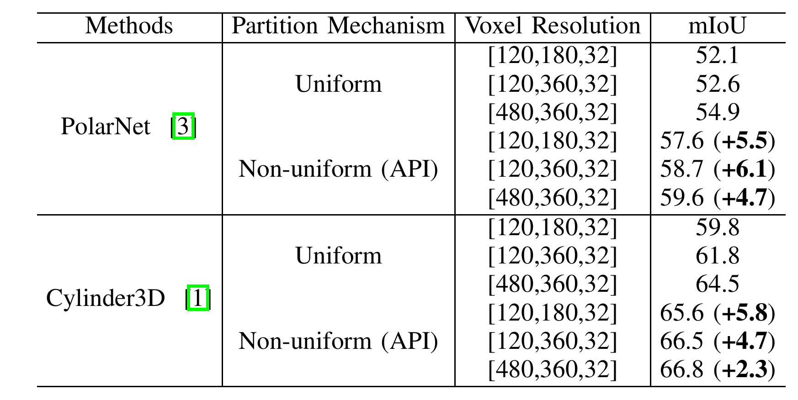

# NUC-Net: Non-uniform Cylindrical Partition Network for Efficient LiDAR Semantic Segmentation

## Project Overview
NUC-Net is a network based on non-uniform cylindrical partitioning for efficient LiDAR semantic segmentation. This method overcomes the high computational cost of traditional -based approaches by adaptively partitioning point cloud data, significantly improving the efficiency and accuracy of LiDAR point cloud processing in large-scale environments.

## Updates
- The code will be publicly released soon. Stay tuned.
- **Non-uniform Cylindrical Partition**: An adaptive partitioning method to better capture the geometric structure of LiDAR point clouds.
- **Nonuniform Multi-scale Aggregation**: A novel feature aggregation technique that dynamically adjusts receptive fields based on spatial distribution.
- **Instance Augmentation**: A data augmentation strategy designed to enhance the robustness of instance-level segmentation.

## Features
- Non-uniform cylindrical partitioning strategy
- Faster and more accurate processing of LIDAR point cloud
- A few lines of code are enough to bring a significant improvement.

## Installation
